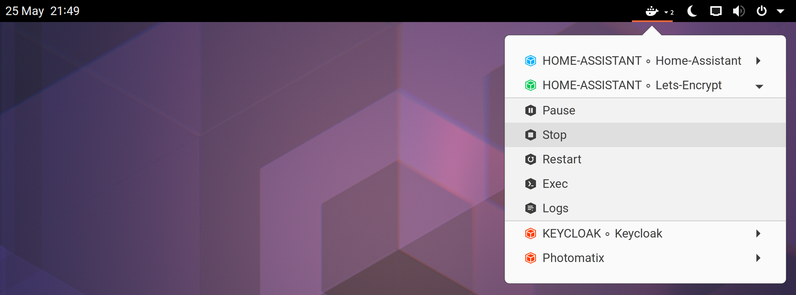

# Docker Containers

This file contains in one place all the required data of the GNOME Shell extension for extensions.gnome.org website to make perfect control of them and keep it in every aspect the up-to-date extraction of main README document.

## Homepage

https://github.com/RedSoftwareSystems/easy_docker_containers

## Icon [^1]


## Screenshot



## Description

```A GNOME Shell extension (GNOME Panel applet) to be able to generally control your available Docker containers.
A GNOME Shell extension *(GNOME Panel applet)* to be able to generally control your available Docker containers.

----- USAGE -----

- Start (Will start the container.)
- Stop (Will stop the container.)
- Pause (Will pause the container.)
- Restart (Will restart the container.)
- Exec (Will log into the running container interactively through your default terminal application.)
- Logs (Will start the running container's Docker logs in your default terminal application.)

----- CREDITS -----

This extension is a fork of gpouilloux's great original 'Gnome Shell extension for Docker' work: https://github.com/gpouilloux/gnome-shell-extension-docker

---- LICENSE -----

GNU - General Public License v3+: https://www.gnu.org/licenses/gpl-3.0.en.html

----- MORE DETAILS -----

https://github.com/RedSoftwareSystems/easy_docker_containers/blob/master/README.md
https://github.com/RedSoftwareSystems/easy_docker_containers/blob/master/CHANGELOG.md
```

---

[^1]: HighRes official GNOME Shell extension like puzzle in GNOME HIG color palette '**Green 5**' color *(#3d3846)* with the extension's GNOME Panel icon in GNOME HIG color palette '**Dark 3**' color *(#3d3846)* rendered in 256x256px with 16px margin.